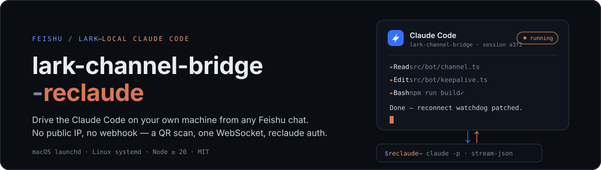
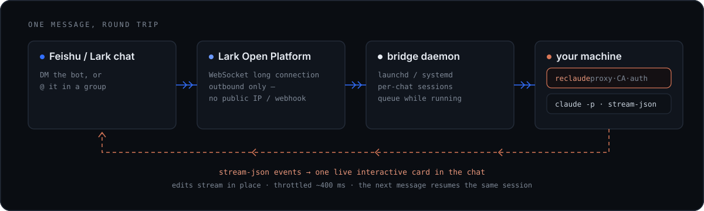

<p align="center">
  
</p>

DM the bot — or `@` it in a group — and the message runs on the Claude Code installed on **your own machine**. The reply streams back into the chat as one live-updating interactive card.

- **No public IP, no webhook.** The bridge dials *out* to Feishu over a single WebSocket long connection; a terminal QR wizard creates the bot and drops credentials into `~/.lark-channel/config.json`.
- **Real sessions.** Each chat resumes its own Claude session; messages sent mid-run queue up and merge into the next turn — at most one run per chat.
- **reclaude-first.** The wizard auto-detects `reclaude` on PATH and spawns Claude through it, so HTTPS proxy, CA certs and auth env come along for free. One config line falls back to plain `claude`.

## How it works

<p align="center">
  
</p>

## Requirements

- macOS (launchd) or Linux (systemd)
- Node.js ≥ 20
- `reclaude` installed and `reclaude status` shows `daemon_running: true`
- `claude` CLI installed

## Install

```bash
git clone https://github.com/ohayoucch/feishu-claude-code-bridge-reclaude.git
cd feishu-claude-code-bridge-reclaude
npm install
npm run build

# 1. Foreground + QR-code wizard (required first time)
node dist/cli.js run
# QR renders in terminal → scan with Feishu app → pick/create a PersonalAgent
# → credentials land in ~/.lark-channel/config.json
# Ctrl+C once you see "ws client ready" + the bot name

# 2. Install as daemon (auto-start at login, auto-restart on crash)
node dist/cli.js start
```

DM the bot in Feishu, or invite it to a group and `@`-mention it.

## Daemon management

```bash
node dist/cli.js status      # state + log paths
node dist/cli.js restart     # restart
node dist/cli.js stop        # stop (keep plist)
node dist/cli.js unregister  # fully uninstall
```

## Settings

`~/.lark-channel/config.json` → `preferences.agent.binary`. The wizard auto-detects reclaude on PATH and presets `"reclaude"`. To use a different wrapper or fall back to `"claude"`, edit here and `restart`.

## Logs

```
~/.lark-channel/logs/daemon-stdout.log
~/.lark-channel/logs/daemon-stderr.log
~/.lark-channel/logs/YYYY-MM-DD.log   # structured daily
```

## Notes

- **Don't move the repo**: the daemon plist hardcodes `dist/cli.js` absolute path. To move: `unregister` → move → `start`.
- **From 2026-06-15 `claude -p` bills against an independent monthly pool**: Pro $20 / Max5x $100 / Max20x $200, doesn't roll over.

---

[中文](./README.zh.md) · Fork of [zarazhangrui/feishu-claude-code-bridge](https://github.com/zarazhangrui/feishu-claude-code-bridge) (upstream PR [#23](https://github.com/zarazhangrui/feishu-claude-code-bridge/pull/23); will be archived once merged) · MIT
