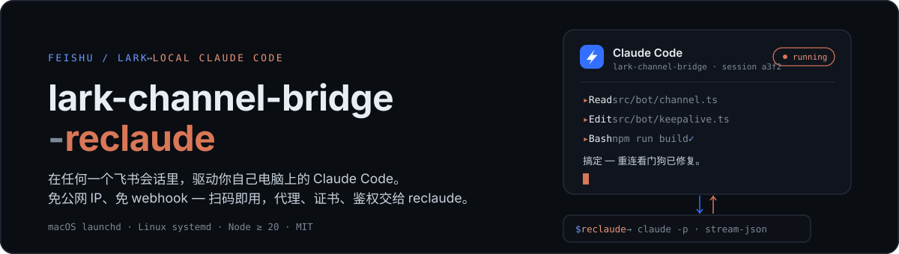
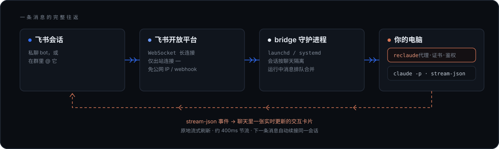

<p align="center">
  
</p>

私聊 bot，或在群里 `@` 它——消息在**你自己电脑上**装的那个 Claude Code 里执行，回复以一张实时刷新的交互卡片流式回到聊天里。

- **免公网 IP、免 webhook。** bridge 主动*出站*一条 WebSocket 长连接直连飞书；终端扫码向导建应用，凭据落 `~/.lark-channel/config.json`。
- **真会话。** 每个聊天各自续接自己的 Claude 会话；运行中发来的消息自动排队、合并进下一轮——每个聊天同时最多一个 run。
- **reclaude 优先。** 向导自动探测 PATH 上的 `reclaude` 并用它拉起 Claude，HTTPS 代理、CA 证书、鉴权环境全程免配；改一行配置可退回裸 `claude`。

## 怎么跑的

<p align="center">
  
</p>

## 要求

- macOS（launchd）或 Linux（systemd）
- Node.js ≥ 20
- `reclaude` 装好且 `reclaude status` 显示 `daemon_running: true`
- `claude` CLI 装好

## 装

```bash
git clone https://github.com/ohayoucch/feishu-claude-code-bridge-reclaude.git
cd feishu-claude-code-bridge-reclaude
npm install
npm run build

# 1. 前台跑 + 扫码绑定飞书应用（首次必须）
node dist/cli.js run
# 终端出 QR → 飞书 App 扫 → 选/建 PersonalAgent → 凭据落 ~/.lark-channel/config.json
# 看到 "ws client ready" 和 bot 名字后 Ctrl+C 退出

# 2. 装为 daemon（开机自启、崩溃自拉）
node dist/cli.js start
```

装完直接打开飞书私聊那个 bot，或拉进群 `@` 它。

## 管 daemon

```bash
node dist/cli.js status      # 看状态 + 日志路径
node dist/cli.js restart     # 重启
node dist/cli.js stop        # 停（保留 plist）
node dist/cli.js unregister  # 彻底卸载
```

## 改设置

`~/.lark-channel/config.json` 的 `preferences.agent.binary`：扫码时 wizard 自动检测到 reclaude 就预设为 `"reclaude"`；要换别的 wrapper 或换回 `"claude"` 直接改这里再 `restart`。

## 日志

```
~/.lark-channel/logs/daemon-stdout.log
~/.lark-channel/logs/daemon-stderr.log
~/.lark-channel/logs/YYYY-MM-DD.log   # 结构化按天
```

## 注意

- **仓库目录别搬**：daemon plist 硬编码 `dist/cli.js` 绝对路径。要搬：`unregister` → 搬 → `start`。
- **2026-06-15 起 `claude -p` 独立计费**：Pro $20 / Max5x $100 / Max20x $200 月度池，不滚存。

---

[English](./README.md) · Fork of [zarazhangrui/feishu-claude-code-bridge](https://github.com/zarazhangrui/feishu-claude-code-bridge)（上游 PR [#23](https://github.com/zarazhangrui/feishu-claude-code-bridge/pull/23) 合并后归档）· MIT
